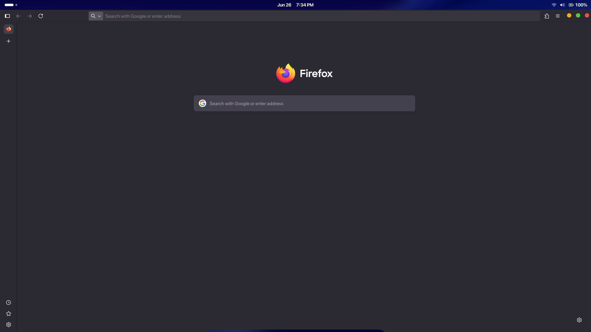

# 🦊 Custom Firefox Titlebar Buttons

Customize Firefox titlebar buttons (close, minimize, maximize/restore) using SVGs.

## ✨ Features

- Add custom SVG icons for titlebar buttons
- Fully customizable button layout and behavior
- Works on Linux and Windows with Firefox custom CSS enabled
- Designed to match any desktop environment (GNOME, macOS-like, etc.)

## 📷 Preview

  
*A modern, custom-styled Firefox titlebar with SVG icons*

## 🔧 Installation

1. **Enable Custom Stylesheets in Firefox:**

   - Go to `about:config`
   - Set `toolkit.legacyUserProfileCustomizations.stylesheets` to `true`

2. **Find your Firefox profile folder:**

   - Open `about:support`
   - Under *Profile Folder*, click *Open Folder*


3. **Copy the chrome folder into your profile directory.

   - Ensure your file structure looks like:
     ```
     chrome/
     ├── userChrome.css
     └── skin/
         //icons
     ```

4. **Restart Firefox** to apply the changes.

## 🎨 Customization

- Modify `userChrome.css` to adjust spacing, colors, or layout.
- Replace the SVG files in `chrome/skin/` with your own.
- You can tweak visibility, hover effects, or per-window-state behavior using CSS.

## ⚠️ Known Issues

- The vertical alignment may differ as it's been hardcoded, I don't do much CSS.


## 📜 License

MIT License — do whatever you want, but attribution is appreciated.

The whole thing has been adapted from https://github.com/vinceliuice/WhiteSur-firefox-theme, the icons were not made by me.
